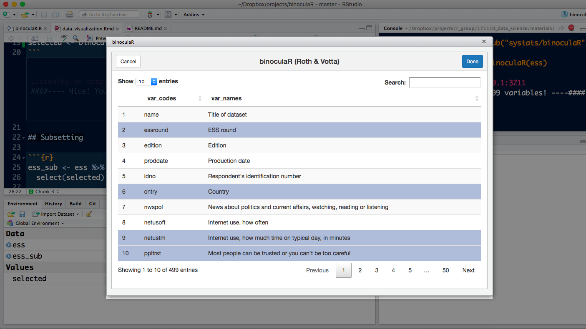

# binoculaR

This is a convienece gadget that returns the Variable Names of a Labeled SPSS dataset. 


## Loading 

Load ESS Round 8 (2016) from github (as SPSS/ SAV File).

```r
# install.packages("haven")
library(haven)
ess <- read_spss("https://github.com/systats/binoculaR/raw/master/data/ess_round8.sav")
```

## Inspecting

Download package from github and proceed with the chunk.

```r
# devtools::install_github("systats/binoculaR", force = T)
selected <- binoculaR::binoculaR(ess)
```


After Selecting the Rows the specific set will be returned as `selected`.

## Subsetting

The dataframe `selected` contains all relevant variable information. The Variable Index can be used to select the reviewed variables. Finally the *dynamic* codebook can be reloaded as needed. 

```r
ess_sub <- ess %>%
  select(selected$index)

binoculaR::binoculaR(ess_sub)
```
